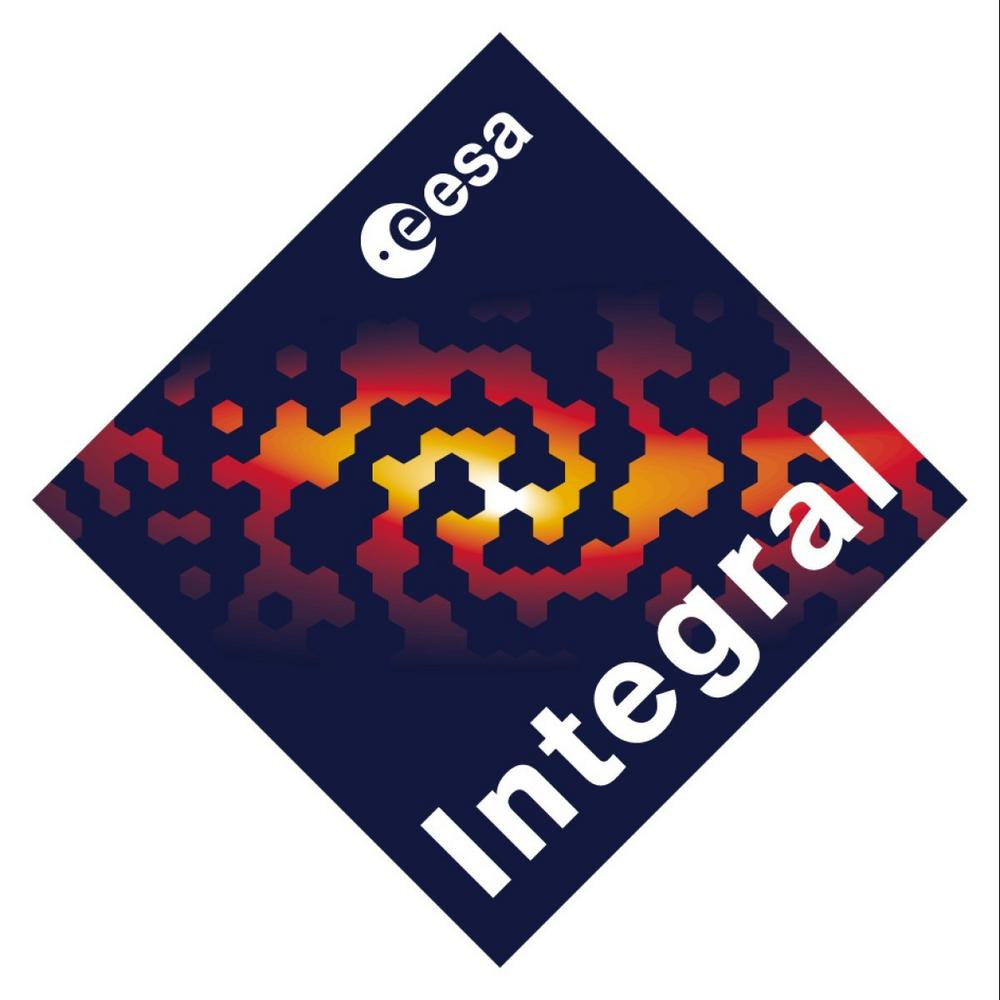

.. _gdt-integral:

****************************************************

Welcome to INTEGRAL Gamma-ray Data Tools Documentation!

****************************************************

The Integral Gamma-ray Data Tools (GDT) is a toolkit for INTEGRAL data built on the 
:external:ref:`GDT Core Package<gdt-core>` and is the next iteration of the 
`Fermi GBM Data Tools <https://fermi.gsfc.nasa.gov/ssc/data/analysis/gbm/gbm_data_tools/gdt-docs>`_. 

The INTEGRAL satellite was launched on October 17, 2002 by a Russian PROTON launcher from 
Baikonur in Kazakstan. It has a highly eccentric orbit with a revolution period around the Earth
of 3 sideral days (slightly less than 72 hours). INTEGRAL was designed for a nominal lifetime of
5 years. In October 2009 it was decided to extend the mission at least up to the end of 2012.
As of June 2023, INTEGRAL continues to operate despite the loss of its thrusters through the use
of its reaction wheels and solar radiation pressure. It consists of ffour main scientific instruments.

1. The gamma-ray spectrometer SPI (20 keV - 8 MeV): The Spectrometer on INTEGRAL (SPI) measure the 
energy of gamma-rays with an extraordinary accuracy over an energy range between 20 keV and 8 MeV. 

2. The gamma-ray imager IBIS (15 keV - 10 MeV): The Imager on Board the INTEGRAL Satellite (IBIS) has
been optimised for fine imaging and precise detection of radiation sources. IBIS achieves an angular 
resolution of 12 arcmin over an energy range between 15 keV and 1 MeV (electron-volt).

3. The two X-ray monitors JEM-X: (JEM-X; 3-35 keV) Coded aperature mask with 2 high pressure microstrip
gas chambers. FOV 4.8°, detector area each 500 cm^2, spatial resolution 3´.

4. The optical monitoring camera OMC (500-850 nm): The OMC is a CCD detector of 1024 x 1024 pixels
located in the focal plane of a 50 mm lens with a V (visible) filter. The total field of view of the 
OMC camera is of 5 x 5 degrees.

.. rubric:: Citing

If you use the INTEGRAL Gamma-ray Data Tools in your research and publications, 
we would definitely appreciate an appropriate acknowledgment and citation! We 
suggest the following BibTex:

::

 @misc{GDT-INTEGRAL,
       author = {Suman Bala},
       title = {INTEGRAL Gamma-ray Data Tools: v2.0.0},
       year = 2024,
       url = {https://github.com/USRA-STI/gdt-integral}
 }
 
 @misc{GDT-CORE,
       author = {Adam Goldstein and William H. Cleveland and Daniel Kocevski},
       title = {Gamma-ray Data Tools Core: v2.0.4},
       year = 2024,
       url = {https://github.com/USRA-STI/gdt-core}
 }
 

.. rubric:: Acknowledgments

The creation of the Integral Gamma-ray Data Tools were funded by the NASA's
Astrophysics Data Analysis Program (ADAP) via grant number 80NSSC21K0651.

***************
Getting Started
***************
.. toctree::
   :maxdepth: 1

   install

******************
User Documentation
******************

Integral Definitions
=================
.. toctree::
   :maxdepth: 1

   missions/integral/time
   missions/integral/frame
   missions/integral/orbit
   
   
Integral Spi
============

Instrument Definitions
----------------------

.. toctree::
   :maxdepth: 1

   missions/integral/spi/spi_acs

----

*******
License
*******
.. toctree::
   :maxdepth: 1
   
   license

Indices and tables
==================

* :ref:`genindex`
* :ref:`modindex`
* :ref:`search`
